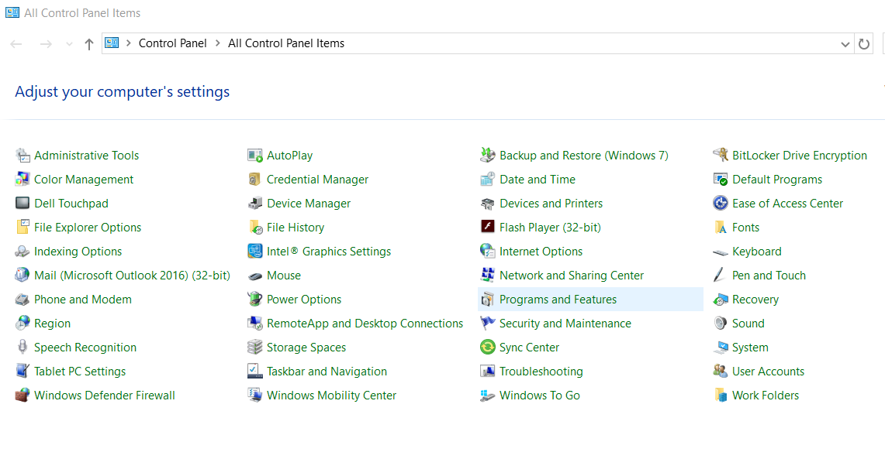
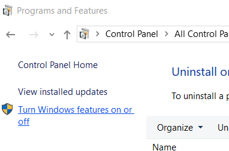

# Giving new Life to Legacy Software with Windows Containers and Kubernetes

## It's not going anywhere

I've worked in or for large enterprises for most of my career.  Among other sectors, I've worked in healthcare, finance, biotech, and government.  At a few companies there was always that one box.  Maybe it's in a rack, maybe it's under a desk.  Some old computer running a long-abandoned version of an operating system, with a sticky-note reminding anyone who might be curious not to power it off.  At one company it was the in-house support system, built in late 90's PHP.  At another it was a billing management system, that had gone from Microsoft Access to an Access MDB with an ASP classic.  Sometimes it's something even older, with a mixture of COBOL, a SQL Server Database and ASP classic.  I wish I were making that up, but I helped write it.  

These apps aren't going anywhere.  They're mission critical to businessess, and often times they fit if it a'int broke don't fix it model.  There may be a plan to replace them, but we need to get the most out of them that we can in the meantime.  Today we're going bring a dying system closer to DevOps.

## The ASP Classic Application

I had to find a simple ASP classic application for this demo.  I couldn't grab one of my old solutions.  They're owned by companies that are either long gone, or with whom I don't have a relationship.  [So I grabbed this application](https://docs.google.com/spreadsheets/d/1N3laLAYO3XJMSUDPy2-GvrxdPh8XBL290u1Zs2s73eo/edit#gid=900701639) from shortly after the time we all survied Y2K.  It's a simple chat application.  For those of you who have been in the Microsoft development community, you likely remember 4 Guys from Rolla.  I learned a lot of ASP and ASP.NET 1.x from this website.  The last of the original 4 guys left in 2011, but the property has been maintained and the old posts archived.

## Software Development and Deployment in 2000

Let me take you back to software development and deployment in the first couple years of this millennium.  Hardware virutalization was not yet a thing in the enterprise.  We were deploying to real-machines either specifically for our applications or sharing hardware with other applications.  Software generally got thrown over a wall from business unit to business unit, this is still unfortunately the case at a lot of companies.  And most if not all deployments were done by hand, some were even done right from a developer's machine.  [Lean Software Development](https://www.oreilly.com/library/view/lean-software-development/0321150783/) wouldn't land until Mary and Tom Poppendieck's book did in 2003.  [The Manifesto for Agile Software Development](https://agilemanifesto.org/) was something we were all dicussing as it landed in 2001.  Movements like [extreme programming](http://www.extremeprogramming.org/) and [Scrum](https://www.scrum.org/resources/what-is-scrum), were being adopted in forward thinking enterprises as they were products of the late 1990's.

So with that in mind let's start containerizing this mini-monolith and take advantage of Kubernetes new Windows Containers to start bring good automation practices to this application.

## Examining the Application

The chat application contains 3 files.

```sh
$ tree chat/
chat/
├── default.htm
├── Display.asp
└── Message.asp
```

### default.htm

This file is the client for the application.  It contains 2 frames in a frameset.  1 frame for chat window, and another where the user types in a message.

```html
<html>
<head><title> chat page </title></head>
<frameset rows="*,82">
    <frame name="chat_top" FRAMEborder="0" src="Display.asp">
    <frame name="chat_message" FRAMEborder="0" src="Message.asp">
</frameset>
</html>
```

### Display.asp

This is the page for the chat display itself.  Message and users are stored in [Application variables](https://support.microsoft.com/en-us/help/300883/how-to-use-session-and-application-variables-in-an-asp-program), which are essentially the persisence layer for this application.

```asp
sub display_body(firstpos,endpos,tmpUser,tmpTimesaid,tmpIP,tmpMesssage)
    for x = firstpos to endpos step - 1
        Response.Write "<TR>"
        Response.Write "<TD BGCOLOR = ""lightgrey"">"  & "&nbsp;" & "</TD>"
        Response.Write "<TD BGCOLOR = ""aqua"">" & tmpTimesaid(x) & "&nbsp;" & "</TD>"
        Response.Write "<TD BGCOLOR = ""orange"">" & tmpUser(x) & "&nbsp;" & "</TD>"
        if session("IP") then
            Response.Write "<TD BGCOLOR = ""white"">" & tmpMesssage(x) & "&nbsp;" & "</TD>"
            Response.Write "<TD BGCOLOR = ""lightgreen"">" & tmpIP(x) & "&nbsp;" & "</TD>"
        else
            if instr(tmpMesssage(x),"http") = 0 then
                Response.Write "<TD BGCOLOR = ""white"" colspan=""2"">" & tmpMesssage(x) & "&nbsp;" & "</TD>"
            else
                Response.Write "<TD BGCOLOR = ""white"" colspan=""2"">" & _
		     "<A href=" & tmpMesssage(x) & ">" _ 
                     & tmpMesssage(x) & "&nbsp;" & "</TD>"
            end if
        end if
        Response.Write "<TD BGCOLOR = ""lightgrey"">"  & "&nbsp;" & "</TD>"
        Response.Write "</TR>"
    next 
end sub
```
### Message.asp

This page actually allows the user to input chat messages, and stores them in the aforementioned Application variables.

```asp
sub putinfo(username,timesaid,ip,message)
    dim TempArray1,TempArray2,TempArray3,TempArray4

    if message = "ip" then 
        session("IP") = true
        message = ""
        exit sub
    end if
    if message = "reset" then 
        session("IP") = false
        message = ""
        exit sub
    end if


    Application.lock
    if Application("Tplace") => Application("Tplaces") then
        Application("Tplace")=0
    else
        Application("Tplace") = Application("Tplace") + 1
    end if
    TempArray1=Application("User")
    TempArray2=Application("timesaid")
    TempArray3=Application("ip")
    TempArray4=Application("Message")

    if instr(1,mid(message,1,3),"cls") = 0 then
        TempArray4(Application("Tplace")) = message
    else 
        redim TempArray1(Application("Tplaces"))
        redim TempArray2(Application("Tplaces"))
        redim TempArray3(Application("Tplaces"))
        redim TempArray4(Application("Tplaces"))
        TempArray4(Application("Tplace")) = "Page Cleared by : " & username
    end if

    TempArray1(Application("Tplace")) = username
    TempArray2(Application("Tplace")) = timesaid 
    TempArray3(Application("Tplace")) = ip 

    Application("User")=TempArray1
    Application("timesaid")=TempArray2
    Application("ip")=TempArray3
    Application("message")=TempArray4
    Application.unlock 
end sub
```

## Does it still work?

First thing I wanted to do was to see if this application would still work with a manual deployment.  To do this I need to run IIS with ASP support.  My development laptop didn't have that installed.  So I installed it.

1. Navigate to Control Panel > Program and Features > Turn Window features on or off




2. Select ASP and Static Content and Click OK


3. Wait for installation to complete, click OK.


4. Do the same with the IIS Management Console


5. Open IIS Mangement Console


6. After Removing the Existing Default Site
Right Click on Application Pools > Add Application Pool
Create the Settings as Shown


7. Create Website
Right Click on the Sites > Add Website


8. Under Site name, Click Select and select the ASP-Pool we just created


9. Select the path where you put the chat app.  Make sure the [IUSR user](https://docs.microsoft.com/en-us/iis/get-started/planning-for-security/understanding-built-in-user-and-group-accounts-in-iis) has access to this path. and click OK.


If your permissions are setup correctly you'll be able to navigate to the chat page.


If not check that the IUSR user has access to the path where you placed the website.


We've not confirm this ancient application can still run on a more modern copy of IIS.  So let's now take advantage of containerization and Kubernetes.

## Sound Automation Practices

Let's assume for a minute you received this application via a zip file like our download today.  There's a couple of practices I would immediately put in place.  Adopting [the first way of DevOps](https://itrevolution.com/the-three-ways-principles-underpinning-devops/) we'll start controlling the workflow from this application to production.  Here are a couple of practices we could put into place.

- Source Control

This application may not have been stored in a source code managment system.  Although there were many available at the time like [PVCS](https://www.microfocus.com/en-us/products/pvcs/overview) and [CVS](https://savannah.nongnu.org/projects/cvs).  The former of which I was surprised was still going although Polytron (the P in PVCS) was acquired and is now part of Micro Focus / Serena Software.

- Automated Build

In this case these files are not built into a binary, so a build step is not necessary.

- Automated Testing

Since this software is in a known working state, we should keep it that way.  The only way to prove that changes to files does not break functionality would be Test Driven Development.  Even if it were not possible to easily test he asp code, it would be possible to test the running application witha framework like [Selenium](https://www.seleniumhq.org).

This is just a start there's a lot more that can be done here, but let's create the container definition for this applications.

## Building the DOCKERFILE

[Windows Containers are versioned according to the underlying version of Windows](https://docs.microsoft.com/en-us/virtualization/windowscontainers/deploy-containers/version-compatibility).  So for this example we're using Windows Server 1903 / Windows Server 2019 as a base since that's [the most recent verision of Windows supported by Kubernetes](https://kubernetes.io/docs/setup/production-environment/windows/intro-windows-in-kubernetes/).

Fortunately the steps we took to get this processing working manually, will help us in developing the Dockerfile.  Keep in mind this is bare-bones installation.  You may want a lot more IIS features, [so check your documentation accordingly](https://docs.microsoft.com/en-us/windows-server/administration/server-core/server-core-roles-and-services).

```Dockerfile
# We need IIS
FROM mcr.microsoft.com/windows/servercore/iis:windowsservercore-1903

# We're going to do our IIS Administration from Powershell
SHELL ["powershell", "-Command"]

# Create the path for the applications
RUN New-Item -Path C:\Chat -ItemType Directory

# Support ASP Classic
RUN Install-WindowsFeature Web-ASP; 
RUN Install-WindowsFeature Web-ISAPI-Ext;

# Support Static Content
RUN Install-WindowsFeature Web-Static-Content;

# Remove the Default Web Site
RUN Remove-Website -Name 'Default Web Site';

# Create a new web site
RUN New-IISSite -Name "chat" \
                -PhysicalPath "c:\chat" \
                -BindingInformation "*:80:";

# Copy the files into the container
COPY chat/*.* /chat/
```

## Build the Container Image

Let's build the image and give it a local test.  My repository is called morehumansoftware, so swap that out for your own.  This will take a few minutes.  Windows Containers are a good deal larger than their Linux counterparts.

```powershell
> docker build -t morehumansoftware/chat:latest .    Sending build context to Docker daemon  890.9kB
Step 1/9 : FROM mcr.microsoft.com/windows/servercore/iis:windowsservercore-1903
windowsservercore-1903: Pulling from windows/servercore/iis
5b663e3b9104: Pull complete                                                                                             0983be2adcfc: Pull complete                                                                                             be6743012ee7: Pull complete                                                                                             2d0d1154c6e6: Pull complete                                                                                             2f8abb35fdf8: Pull complete                                                                                             Digest: sha256:214969782a7ddc30e8fadb91fe5af0224d1870454c8986416ca2e6f0f8177d91
Status: Downloaded newer image for mcr.microsoft.com/windows/servercore/iis:windowsservercore-1903
 ---> 51ad3869d6c2
Step 2/9 : SHELL ["powershell", "-Command"]
 ---> Running in 772b7a44ea97
Removing intermediate container 772b7a44ea97
 ---> 36a9a1fdff61
Step 3/9 : RUN New-Item -Path C:\Chat -ItemType Directory
 ---> Running in 05d4f00bb713


    Directory: C:\


Mode                LastWriteTime         Length Name
----                -------------         ------ ----
d-----       10/15/2019   8:36 PM                Chat


Removing intermediate container 05d4f00bb713
 ---> b765c8977dd7
Step 4/9 : RUN Install-WindowsFeature Web-ASP;
 ---> Running in 0b3d31c7371b

Success Restart Needed Exit Code      Feature Result
------- -------------- ---------      --------------
True    No             Success        {Application Development, ASP, ISAPI 


Removing intermediate container 0b3d31c7371b
 ---> 3258901cd23b
Step 5/9 : RUN Install-WindowsFeature Web-ISAPI-Ext;
 ---> Running in 96dbf5f064a7

Success Restart Needed Exit Code      Feature Result
------- -------------- ---------      --------------
True    No             NoChangeNeeded {}


Removing intermediate container 96dbf5f064a7
 ---> 2bd40f6a4288
Step 6/9 : RUN Install-WindowsFeature Web-Static-Content;
 ---> Running in 1efa2222e42d

Success Restart Needed Exit Code      Feature Result
------- -------------- ---------      --------------
True    No             NoChangeNeeded {}


Removing intermediate container 1efa2222e42d
 ---> e8a78a856d06
Step 7/9 : RUN Remove-Website -Name 'Default Web Site';
 ---> Running in 1337a7950e31
Removing intermediate container 1337a7950e31
 ---> 6c2f7803a7a1
Step 8/9 : RUN New-IISSite -Name "chat"                 -PhysicalPath "c:\chat"                 -BindingInformation "*:80:";
 ---> Running in bd9a7a8e1eea
Removing intermediate container bd9a7a8e1eea
 ---> 8515c20a2783
Step 9/9 : COPY chat/*.* /chat/
 ---> 426c2823dbd7
Successfully built 426c2823dbd7
Successfully tagged morehumansoftware/chat:latest
```

## Test the Container Image

Let's test this locally and see if it works.

```powershell
docker run -d -p 8080:80 morehumansoftware/chat:latest
6ea35053ba4cfe8720319781307b7ea0e0efeec3890027e73ed95d243ca1d0fb
```

Now opening my browser to http://localhost:8080/default.htm, I see my containerized ASP Classic application.


## Easy Gains

So what have we gained already? Beside source control and the ability to test our code, we've lost the need for our old hardware.  This method easily applies to pretty much any application that can be installed and configured via the command line.  For those that have other install methods I've used this general guidelines  

1. Take a snapshot of an empty operating system, pre-install.
2. Install the application.
3. Track the changes made by the installer, including changes to system folders and the registry.
4. Copy binaries and save it to a source repository.
5. Script the changes to the registry using powershell.
6. Create a Dockerfile that immitates the installation process and registry changes.

Containerizing other applications may be more difficult, but the gains are worth it.  In addtion to the aforementioned progress, there is now a unified and consistent deployment model for all application types and operating system configurations.  Now let's take things to the next level with Kubernetes.

## Taking to the next level with Kubernetes

Don't forget to push the container to your registry.

```powershell
> docker login
Login with your Docker ID to push and pull images from Docker Hub. If you don't have a Docker ID, head over to https://hub.docker.com to create one.
Username: morehumansoftware
Password:
Login Succeeded
> docker push morehumansoftware/chat:latest
The push refers to repository [docker.io/morehumansoftware/chat]
860353da9a99: Pushed                                                                                                    5f33bfa70264: Pushed                                                                                                    46cb1fda680e: Pushed                                                                                                    9a94f4d4e675: Pushed                                                                                                    49ec62b8e1aa: Pushed                                                                                                    a2c5774b5d33: Pushed                                                                                                    24e13c2cb2eb: Pushed                                                                                                    4728f6996c06: Pushed                                                                                                    eea7f395fb87: Pushed                                                                                                    562af81fadee: Pushed                                                                                                    649f50d15bee: Pushed                                                                                                    06122f538552: Skipped foreign layer                                                                                     734d75c7186c: Skipped foreign layer                                                                                     latest: digest: sha256:96295c739d9a31cb5734865418d48cf1d1cb0887c1e99546b94ec7c414e663bb size: 3255
```

I've setup a Rancher Cluster, with a managed cluster that includes Window Nodes.  I've done this with the automation at https://github.com/jasonvanbrackel/cattle-drive

### Scheduling with Multiple OSes

In addition to the provisioning done in this script.  Let's add one thing.  Once the Windows node becomes active in the cluster taint the Windows node with a NoSchedule taint.  We do this so that Kubernetes doesn't schedule linux container images to the Windows node.


Make note of the OS label as well.


### Automatic multi-tenacy using Kubernetes Deployments, Services and Ingresses

Let's create two deployments, two services and two ingresses.  One per tenant.

We're going to execute the yaml below in the cluster using the Import YAML button in the default project.  It will create the deployment, service, ingress sets we discussed earlier.  Just make sure you replace <publicip> with the public ip address of one of the ingress (linux worker) nodes.

```yaml
apiVersion: apps/v1
kind: Deployment
metadata:
  labels:
    app: chat-one
  name: chat-one
  namespace: default
spec:
  progressDeadlineSeconds: 600
  replicas: 1
  revisionHistoryLimit: 10
  selector:
    matchLabels:
      app: chat-one
  strategy:
    rollingUpdate:
      maxSurge: 1
      maxUnavailable: 0
    type: RollingUpdate
  template:
    metadata:
      labels:
        app: chat-one
    spec:
      affinity:
        nodeAffinity:
          requiredDuringSchedulingIgnoredDuringExecution:
            nodeSelectorTerms:
            - matchExpressions:
              - key: kubernetes.io/os
                operator: In
                values:
                - windows
      containers:
      - image: morehumansoftware/chat:latest
        imagePullPolicy: Always
        name: chat-one
        ports:
        - containerPort: 80
          name: chat-one-port
          protocol: TCP
      tolerations:
      - effect: NoSchedule
        key: windows-only
        operator: Equal
        value: "true"
---
apiVersion: v1
kind: Service
metadata:
  labels:
    app: chat-one
  name: chat-one-nodeport
  namespace: default
spec:
  ports:
  - name: chat-one-port
    port: 80
    protocol: TCP
    targetPort: 80
  selector:
    app: chat-one
  type: NodePort
---
apiVersion: extensions/v1beta1
kind: Ingress
metadata:
  labels:
    app: chat-on
  name: chat-one-ingress
  namespace: default
spec:
  rules:
  - host: chat-one-ingress.default.<publicip>.xip.io
    http:
      paths:
      - backend:
          serviceName: chat-one-nodeport
          servicePort: 80
        path: /
---
apiVersion: apps/v1
kind: Deployment
metadata:
  labels:
    app: chat-two
  name: chat-two
  namespace: default
spec:
  progressDeadlineSeconds: 600
  replicas: 1
  revisionHistoryLimit: 10
  selector:
    matchLabels:
      app: chat-two
  strategy:
    rollingUpdate:
      maxSurge: 1
      maxUnavailable: 0
    type: RollingUpdate
  template:
    metadata:
      labels:
        app: chat-two
    spec:
      affinity:
        nodeAffinity:
          requiredDuringSchedulingIgnoredDuringExecution:
            nodeSelectorTerms:
            - matchExpressions:
              - key: kubernetes.io/os
                operator: In
                values:
                - windows
      containers:
      - image: morehumansoftware/chat:latest
        imagePullPolicy: Always
        name: chat-two
        ports:
        - containerPort: 80
          name: chat-two-port
          protocol: TCP
      tolerations:
      - effect: NoSchedule
        key: windows-only
        operator: Equal
        value: "true"
---
apiVersion: v1
kind: Service
metadata:
  labels:
    app: chat-two
  name: chat-two-nodeport
  namespace: default
spec:
  ports:
  - name: chat-two-port
    port: 80
    protocol: TCP
    targetPort: 80
  selector:
    app: chat-two
  type: NodePort
---
apiVersion: extensions/v1beta1
kind: Ingress
metadata:
  labels:
    app: chat-two
  name: chat-two-ingress
  namespace: default
spec:
  rules:
  - host: chat-two-ingress.default.<publicip>.xip.io
    http:
      paths:
      - backend:
          serviceName: chat-two-nodeport
          servicePort: 80
        path: /
```

Without any application modification, we're now able to make this application multi-tenant.  This is just the beginning.  Here are a few other ideas that you could accomplish without code modification.

- Support for TLS which was not available in 2000
- Resource quota enforcement
- Enhanced observability via tools like Prometheus and Grafana

This really is just the beginning.  You now have a safe, reliable, repeatable and recoverable application paradigm that allows you to continue the development of this application or slowly replace it with whatever is next.